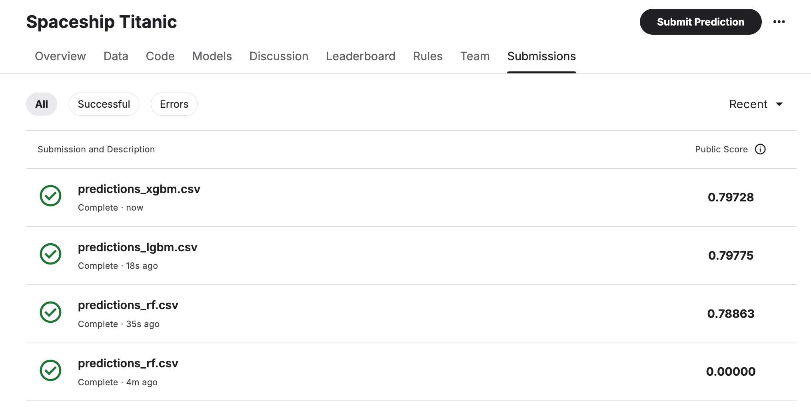

# Space Titanic ML Project

    

## Project Overview

This project focuses on developing a machine learning model to predct whether a passenger was transported off of a spaceship in a simulated diasaster event. The primary objective is to achieve a classification accuracy of over 80% on the prediction dataset. Through this project i aim to deepen my understanding of scikit-learn, and develop custom classes and functions for use in future machine learning workflows.

## Problem Statement

The problem is a binary classification task, in which the model predicts the liklihood of a passenger being transported off of a spaceship in a freak disaster event, based on various passenger-related features.

## Project Goals

1. Build a classification model that achieves over 80% accuracy on the prediction dataset
2. Develop and use custom classes and functions to structure machine learning projects for efficient preprocessing, feature engineering, and evaluation
3. Continue developing [MLToolz](https://github.com/mailliwJ/MLToolz) and [VizToolz](https://github.com/mailliwJ/VizToolz) scripts which have now been turned into packages for easier access and use in future projects.

## Dataset Description

Two datasets were available for this project via [Kaggle](https://www.kaggle.com/competitions/spaceship-titanic/data)
; a training set and a predictions set. Both datasets include the same features, except for the prediction set no having the target feature, 'Transported'. The features are all based on passenger-related information. The table below outlines the features. The training set is fairly clean, however all columns except `PassengerId` and `Transported` have missing values that require addressing. The original features are described in the table below:

|Feature|Description|
|-|-|
|`PassengerId`|A unique Id for each passenger. Each Id takes the form gggg_pp where gggg indicates a group the passenger is travelling with and pp is their number within the group. People in a group are often family members, but not always|
|`HomePlanet`|The planet the passenger departed from, typically their planet of permanent residence|
|`CryoSleep`|Indicates whether the passenger elected to be put into suspended animation for the duration of the voyage. Passengers in cryosleep are confined to their cabins|
|`Cabin`|The cabin number where the passenger is staying. Takes the form deck/num/side, where side can be either P for Port or S for Starboard|
|`Destination`|The planet the passenger will be debarking to|
|`Age`|The age of the passenger|
|`VIP`|Whether the passenger has paid for special VIP service during the voyage|
|`RoomService`|Amount the passenger has billed for room service|
|`FoodCourt`|Amount the passenger has billed at the food court|
|`ShoppingMall`|Amount the passenger has billed at the shopping mall|
|`Spa`|Amount the passenger has blled at the spa|
|`VR Deck`|Amount the passenger has billed at the VR deck|
|`Name`|The first and last name of the passenger|
|`Transported`|Whether the passenger was transported to another dimension. This is the target, the column you are trying to predict|

## Key Feature Creation

Some of the features do not contribute much insight directly, however they can be transformed into more useful features. I have created the following features:

## Data Preprocessing and Feature Engineering

After a brief exploration of the training dataset I devised a strategy for imputing missing values. I decided to use a combination of methods combining simple imputation and proportional imputation and a KNN imputer
I have used custom transformer classes to carry out imputation within pipelines

Pipeline set-up
the development of a working pipeline structure took several iterations to overcome various errors. The final pipeline solution is very important for the prevention of data leakage and the preservation of an unseen validation set during cross-validation. Using a pipeline ensures that for each fold and validation set in cross validation, the training set is used to calulate required information for imputation and this calulated information is then used to impute missing data or carry out KNN on the validation fold.

## Model Selection and Evaluation

I initially ran baseline tests on the following algorithms:
- Logistic Regression
- Support Vector Classifer
- Random Forest Classifier
- Light GBM Classifier
- XGBoost Classifier
- Catboost Classifier

I continued to tune the hyperparameters using GridSearhCV of:
- Random Forest Classifier
- Light GBM Classifier
- XGBoost Classifier

Final models where then evaluated against a reserved and unused validation set. All models were evaluated for accuracy as this is the metric required for a submission to the Kaggle competition, however, i looked at precision, recall, f1 and ROC-AUC as well.

Classification reports and confusion matrices were used to aid evaluation

## Voting and Stacking methods
- Sideline investigation into potential for a stacked and or voting classifier

## Results

The following image shows the submission results on my Kaggle account:

    

## Project Structure

- `data/`: Folder containing raw and processed datasets
- `imgs/`: Folder continaing images used in notebooks
- `models/`: Folder containing saved models
- `submissions/`: Contains the .csv files to be submitted to Kaggle
- `notebooks/`: Jupyter notebooks documenting data exploration, preprocessing, feature engineering, model construction and evaluation
- `utils/`: Python scripts for custom functions, preprocessing classes and pipeline setup
- `README.md`: Project overivew and documentation
- `presentation.ppt`: ppt presentation of this project
- `projectBrief.md`: Summary of the project task
